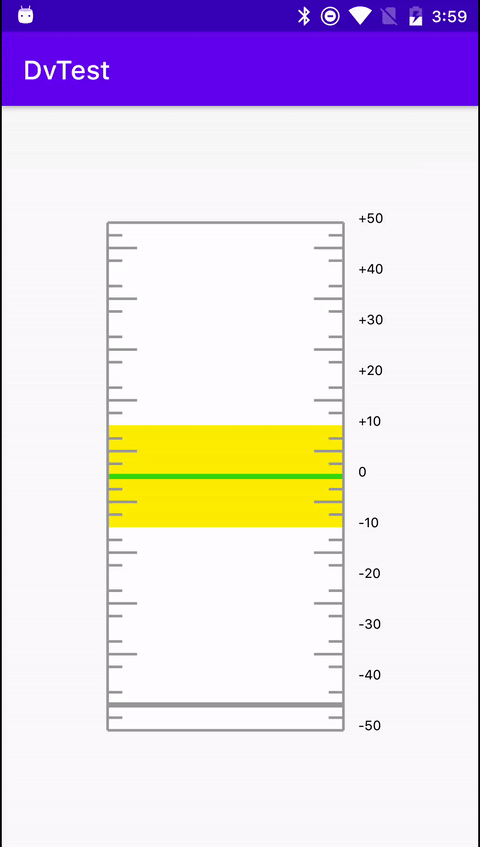
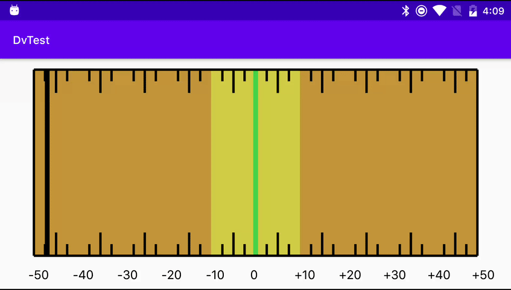

# DeviationView

A View to show some parameter deviation between -50 cents and 50 cents.

  [](https://android-arsenal.com/api?level=19) [](https://jitpack.io/#sizeofanton/DeviationView)





### Add to Gradle

Add this yo your project level `build.gradle` file:

```gradle
repositories {
  maven { url "https://jitpack.io" }
}
```

Abd then add this to your module level `build.gradle` file:

```gradle
dependencies {
  implementation 'com.github.sizeofanton:DeviationView:1.0'
}
```

### Set up

Add it to your layout:

```xml
<layout
        ...
        <com.sizeofanton.deviationview.DeviationView
        android:id="@+id/dView"
        android:layout_width="611dp"
        android:layout_height="320dp"
        app:layout_constraintBottom_toBottomOf="parent"
        app:layout_constraintEnd_toEndOf="parent"
        app:layout_constraintStart_toStartOf="parent"
        app:layout_constraintTop_toTopOf="parent"
        app:orientation="horizontal"
        app:scaleBgColor="#c29438"
        app:scaleFrontierColor="#cfcc44"
        app:scaleCentralColor="#44cf46"
        app:scaleContourVisibility="true"
        app:scaleContourColor="#000000"
        app:scaleFontColor="#000000"
        app:scalePointerColor="#000000"
        app:scalePointerVisibility="true" />     
        ...
</layout>
```

Available xml attributes:

| Attribute              | Type                       | Description                                   |
| ---------------------- | -------------------------- | --------------------------------------------- |
| orientation            | enum {verival, horizontal} | Scale orientation - vertical or horizontal    |
| scaleBgColor           | color                      | Scale background color                        |
| scaleFrontierColor     | color                      | Color of the [-10..10] sector                 |
| scaleCentralColor      | color                      | Color of the [-1..1] sector                   |
| scaleContourColor      | color                      | Color of the scale contour and scale marks    |
| scaleFontColor         | color                      | Color of labels                               |
| scalePointerColor      | color                      | Color of pointer                              |
| scaleContourVisibility | boolean                    | Is contour visible (marks are always visible) |
| scalePointerVisibility | boolean                    | Is pointer visible                            |

Methods, available from code:

```kotlin
fun setPointerColor(color: Int)
fun setPointerColor(a: Int, r: Int, g: Int, b: Int)
fun setContourColor(color: Int)
fun setContourColor(a: Int, r: Int, g: Int, b: Int)
fun setScaleBackgroundColor(color: Int)
fun setScaleBackgroundColor(a: Int, r: Int, g: Int, b: Int)
fun setCentralSectorColor(color: Int)
fun setCentralSectorColor(a: Int, r: Int, g: Int, b: Int)
fun setFrontierSectorColor(color: Int)
fun setFrontierSectorColor(a: Int, r: Int, g: Int, b: Int)
fun setFontColor(color: Int)
fun setFontColor(a: Int, r: Int, g: Int, b: Int)
```

Fields, available from code: `pointerPosition` - Int, `pointerVisible` - Boolean, `contourVisible` - Boolean